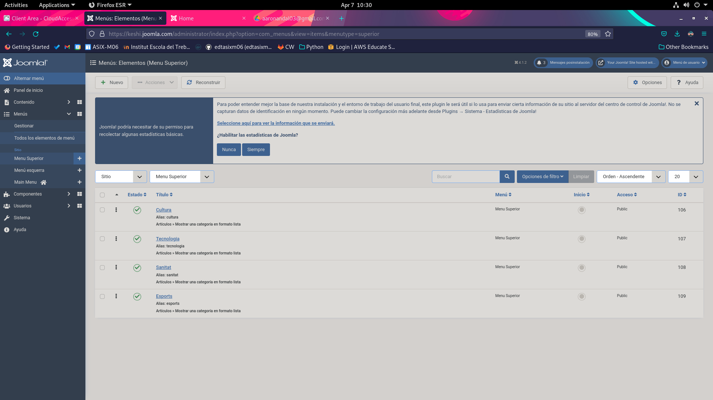
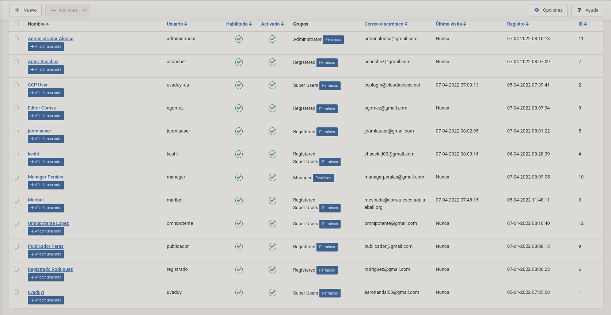

# M09 - Aplicaciones Web
## Escola Del Treball
### 2HISX 2021-2022
### Aaron Andal

# JOOMLA

Joomla és un sistema de gestió de continguts (en anglès Content Management System, o CMS) que permet desenvolupar llocs web dinàmics i interactius. 

Permet crear, modificar o eliminar contingut d'un lloc web de manera senzilla a través d'un Panell d'Administració. 

És un programari de codi obert, desenvolupat en PHP i alliberat sota llicència GPL. 

Aquest administrador de continguts pot utilitzar-se en un PC local (en Localhost), en una Intranet oa través d'Internet i requereix per al seu funcionament una base de dades creada amb un gestor de bases de dades (MySQL és el més habitual), així com de un servidor HTTP Apache.

# LANZAMIENTO

https://launch.joomla.org/ 

https://ccp.cloudaccess.net/clientarea.php 

--> *BACKEND* --> https://keshi.joomla.com/administrator/index.php?catoken=6aa6f1e76aabf0e5c613f82a2265913985dcacf7be79a060e286d018ff8e29a4&ccp=1

Maribel:JoomlaMaribel

--> **Open Administrator**

Para ponerlo en Español --> System --> Language --> Spanish --> Install (Reinstall)

--> User Menu --> Ajustes de accesibilidad --> Configuración básica --> Idioma de administración (2) - For ENT --> España - FRONTEND - BACKEND --> **SAVE AND CLOSE**.

# EJERCICIO 1

* Estructura de Directorios

--> CONTENIDO --> CATEGORIES --> NUEVO --> 

--> Joomla --> Categorias

--------------------------------------

# Poner el usuario de Maribel para que acceda.

--------------------------------------

# Ejercicio 2

* Instalar módulo para que se puedan registrar los usuarios en el FRONTEND

--> Sistema --> Configuración Global --> Usuarios

---------------------------------------

Para que usuarios tengan acceso a la categoria TEATRO MUSICAL:
- Entrar dentro de la categoria MUSICAL
    Acceso*: Registered

---- HEREDAR PERMISOS

ELEMENTS DE MENU NO CATEGORIAS

ENJAULARLO POR MENU Y NO CATEGORIA, SE PODRÍA TAMBIÉN POR CATEGORIAS

# Ejercicio 3 Modulos

# Ejercicio 4 Idioma

----------------------------------------------

# PR2 - GESTOR DE CONTINGUTS

# Exercici 1 - USUARIS FRONT-END + Exercici 2 - BACKEND + Exercici 3

● Crea un usuari per a cada tipus que permet Joomla amb accés al FRONT-END.

* USUARIOS --> GESTIONAR --> NUEVO --> 

joomlauser

password: joomlauserjoomlauser

Permisos **Registered**

----------------------

# EXERCICI 7 USUARIS - FRONT END

Dels elements de menú que tens creats decideix quins seran públics i quins no, és a dir, quan accedim a la pàgina web sense estar registrats, de manera pública, quina part serà visible per a tothom i quina no. 

## Modificació de moduls - menu - Edició de permisos adherents a les categories desde Menu. 

    

    

    

## Acces Superuser

    

## Acces Public No Registered

    

Per exemple: Cultura, esports, política i societat visibles per a tothom; la resta
no visibles per a tothom.

# EXERCICI 8 USUARIS - FRONT END

Fes el mateix que l’exercici anterior, però en aquest cas la part que has decidit que no sigui pública, és a dir, no visible per a tothom, ha de ser visible pels usuaris del front-end (Registrado Rodríguez, Autor Sánchez, Editor Gómez, Publicador Pérez)

    

    

    

