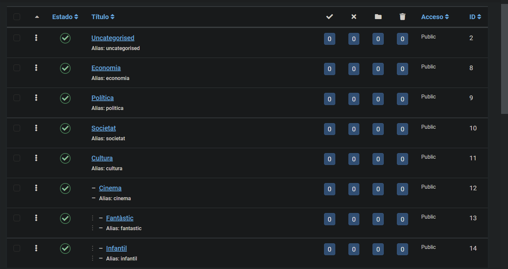
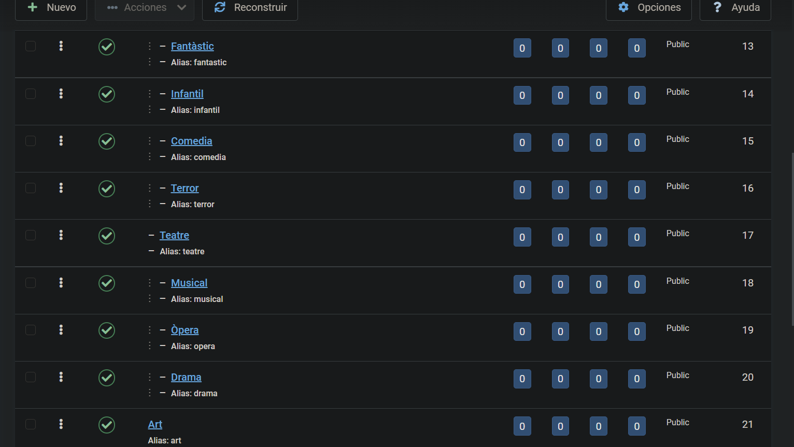
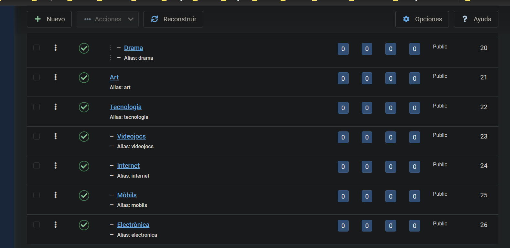
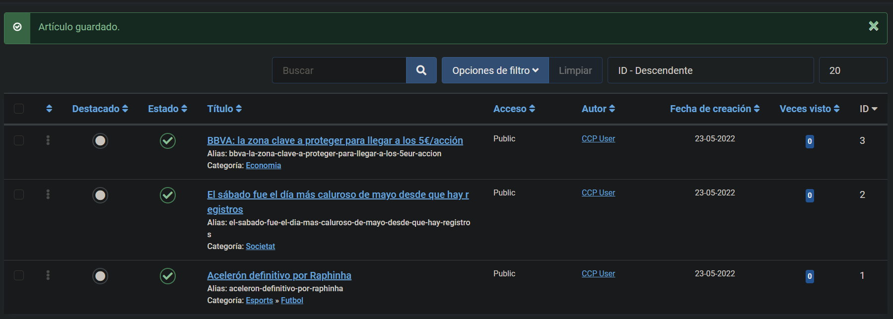
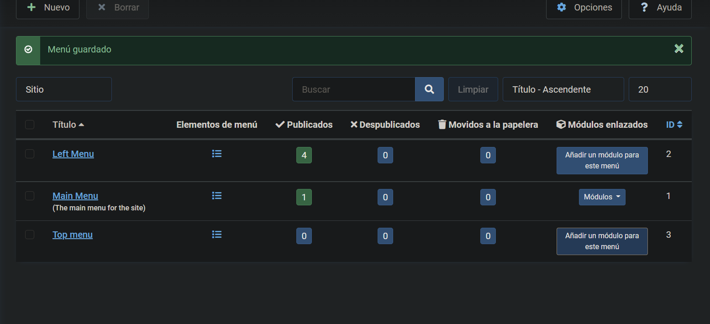
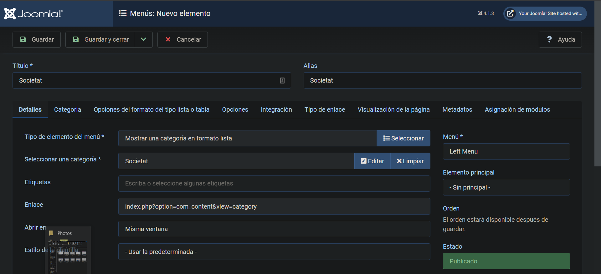
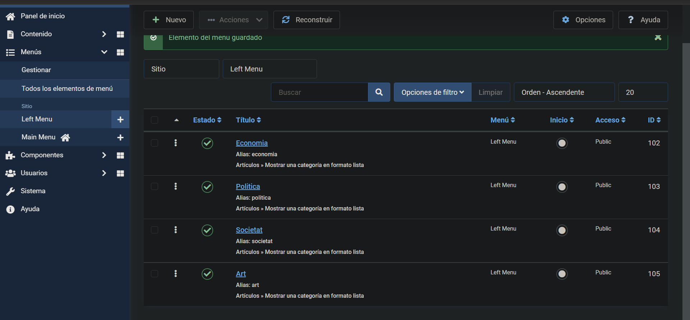
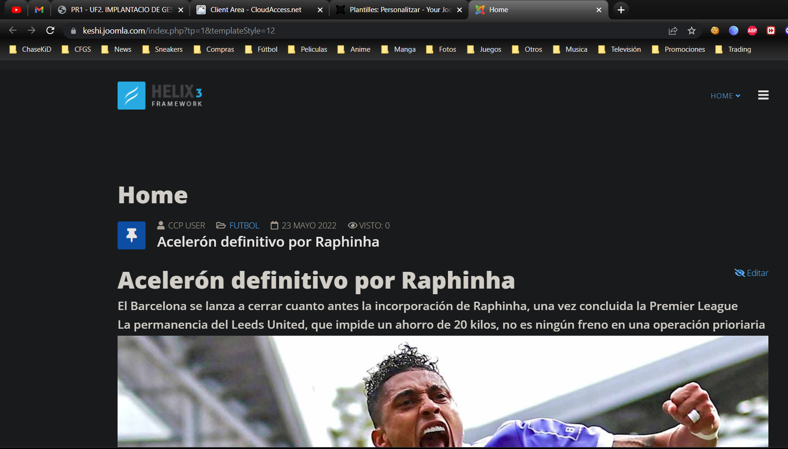

# Aaron Andal
# M09 IMPLANTACIÓ D’APLICACIONS WEB
# UF2. IMPLANTACIÓ DE GESTORS DE CONTINGUTS

# JOOMLA

USER: maribel

PASSWORD: maribelmaribel

# Exercici 1 - CATEGORIE:

# Exercici 2 - ARTICLE:

# Exercici 3 - MENÚS I MÒDULS:

Menus --> Gestionar --> Nou menu

Menus --> Tots els elements de menú --> Crear nou element de menú --> Articles en fila --> Left / Top Menu --> Categoria d'article a seleccionar.

# Ex4: Language CAT :

Configuracó - Idiomes - CAT

# Ex5: Template :

Configuracó - Idiomes - CAT

