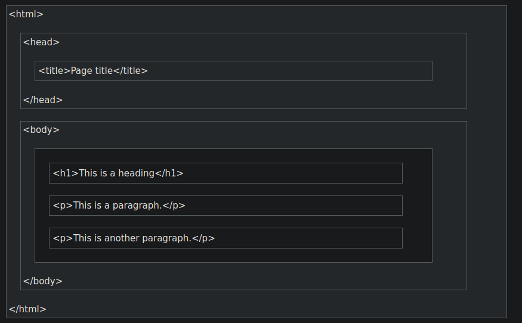

# Repaso HTML

<br>

> **PYDIO** + **XAMPP en Windows** --> Tiene el LAMP

<br>

* Tenemos un Apache y un MySQL 

<br>

> Revisa `Documentació PYDIO+XAMPP(Andal_Aaron)-Windows.pdf`

<br>
<br>

### Plantilla básica HTML

<br>

```html
<!DOCTYPE html PUBLIC "-//W3C//DTD XHTML 1.0 Transitional//EN" "http://www.w3.org/TR/xhtml1/DTD/xhtml1-transitional.dtd">
<html xmlns="http://www.w3.org/1999/xhtml">
    <head>
        <meta http-equiv="Content-Type" content="text/html; charset=UTF-8" />
        <title>Plantilla</title>
        <style>
        
        </style>
    </head>

    <body>

    </body>
</html>

```

**Example Explained**
```
The <!DOCTYPE html> declaration defines that this document is an HTML5 document

The <html> element is the root element of an HTML page

The <head> element contains meta information about the HTML page

The <title> element specifies a title for the HTML page (which is shown in the browser's title bar or in the page's tab)

The <body> element defines the document's body, and is a container for all the visible contents, such as headings, paragraphs, images, hyperlinks, tables, lists, etc.

The <h1> element defines a large heading

The <p> element defines a paragraph
```

<br>

<div style="padding: 5%">
    
</div>

### CSS en HTML - < STYLE >


```html
    <style>
        table {
            font-size: 20px;
            border: hidden;
            width: 100%;
        }
        td {
            border: hidden;
            font-family: verdana;
            font-size: 17px;
        }
        th {
            border: solid 1px;
            font-family: verdana;
            font-size: 20px;
        }
        a {
            color: white;
        }
    </style>
```

### HTML Etiquetas CHEATCHEET


```html

<body>

    # Tablas

    <table> </table> -- Tablas

    <tbody> --> Body de la Tabla

    <tr> - Table Row

        <th> - Table HEADER

        <td> -- Table DATA

    # Alineo

    <center> - Centro

    # Contenedor

    <div> --> Contenedor

    # Listas

    <dl> --> Description List

        <dt> --> Description Name

        <dd> --> Description Data

    # Links 

    <a href=""> --> Hipervinculo LINK

    # Imagenes

     --> Img

    <h1> to <h6> --> Headers

    <ol> --> Lista ordenada

    <ul> --> Lista no ordenada

    <textarea> --> Multilinea de TEXTO

    <strong> --> Important text

    <span> --> Sección en un documento

    <small> --> Texto más pequeño

    <p> Paragrafo

    <form> --> Formulario

</body>

```

### CSS Atributos (Clear Sheet Style)

```html

<style>

    .keshiDiv{
        
        /* Padding */

        padding: 10px o 10%;
        padding-top: ;
        padding-bottom: ;

        /* Margin */

        margin: 10px;

        /* Colores */

        background-color: ;
        color: ;
        
        text-align: ;
        font-family: ;
        font-size: ;

        border:
        border-color: red;
        border-bottom: ;
        border-bottom-color: ;
    }

    p {

    }

    h1 {

    }

    h2 {

    }

    h3 {

    }
</style>

```

### CSS - Classes .

```html
<style>
    .myDiv{
        border: 5px outset red;
        background-color: lightblue;
        text-align: center;
    }
</style>

<div class="myDiv">
    <h2>Heading in Div Element</h2>
</div>
```


### DIV

```html

```

### Tablas

```html
<!DOCTYPE html>
<html>
<style>
table, th, td {
  border:1px solid black;
}
</style>
<body>

<h2>TH elements define table headers</h2>

<table style="width:100%">
  <tr>
    <th>Person 1</th>
    <th>Person 2</th>
    <th>Person 3</th>
  </tr>
  <tr>
    <td>Emil</td>
    <td>Tobias</td>
    <td>Linus</td>
  </tr>
  <tr>
    <td>16</td>
    <td>14</td>
    <td>10</td>
  </tr>
</table>

<p>To undestand the example better, we have added borders to the table.</p>

</body>
</html>

```

```html

```

```html

```

```html

```

```html

```

```html

```

```html

```

```html

```

```html

```

```html

```

```html

```

```html

```


```html

```


```html

```


```html

```


```html

```


```html

```


```html

```