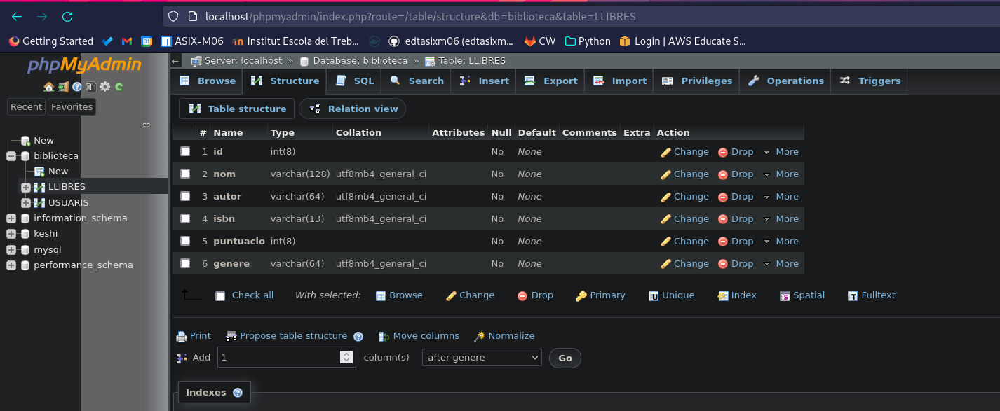
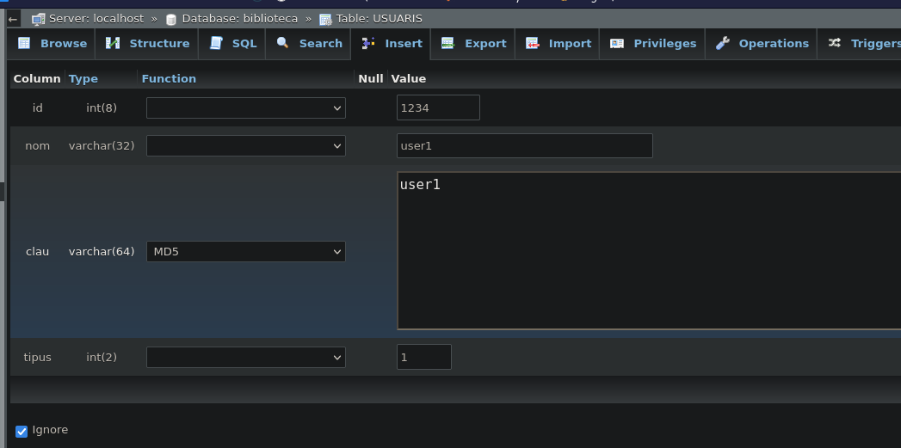
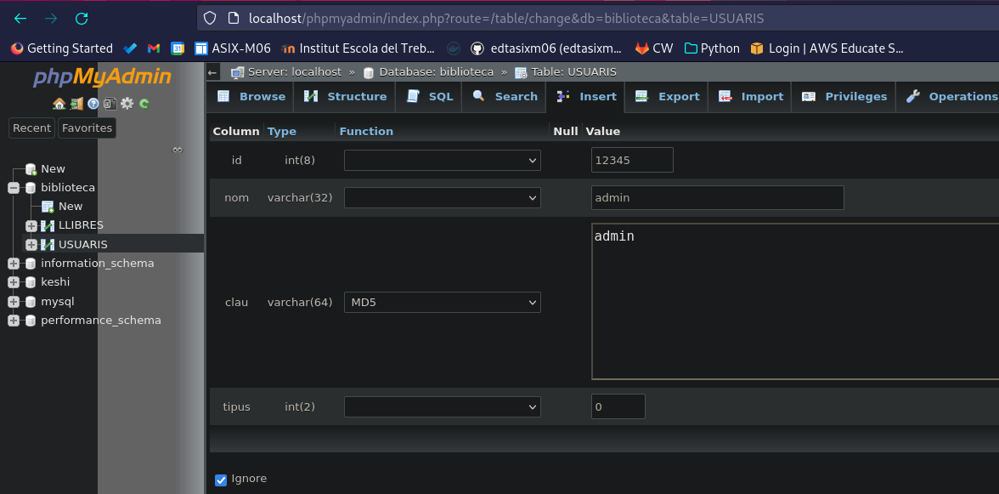
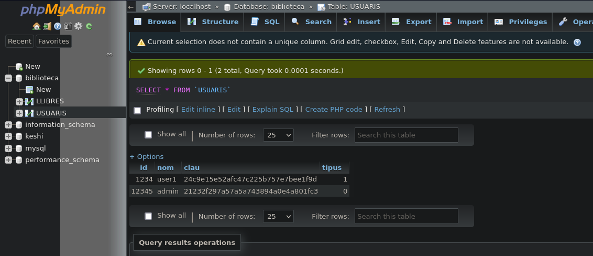

# M09 - Aplicacions Web
## Escola Del Treball
### 2HISX 2021-2022
### Aaron Andal

# Requisitos necesarios

# Instalación

# DEBIAN

https://phoenixnap.com/kb/how-to-install-phpmyadmin-on-debian-10#ftoc-heading-7 

https://phoenixnap.com/kb/how-to-create-mariadb-user-grant-privileges

https://computingforgeeks.com/install-phpmyadmin-with-apache-on-debian/

# UBUNTU

<br>
<br>
<br>

# ACTIVITAT 1

Crear una base de dades amb PHPMyAdmin.

La base de dades es dirà **biblioteca** i tindrà **dues taules**

Taula usuaris i Taula Llibres

Taula usuaris:
    NOM - TIPUS - MIDA

    id - INT - 8
    nom - VARCHAR - 32
    clau - VARCHAR - 64
    tipus - INT - 2

Taula llibres:
    NOM - TIPUS - MIDA

    Id - ID - 8
    nom - VARCHAR - 128
    autor - VARCHAR - 64
    isbn - VARCHAR - 13
    puntuacio - INT - 8
    genere - VARCHAR - 64


```sql
CREATE TABLE `biblioteca`.`LLIBRES` ( `id` INT(8) NOT NULL , `nom` VARCHAR(128) NOT NULL , `autor` VARCHAR(64) NOT NULL , `isbn` VARCHAR(13) NOT NULL , `puntuacio` INT(8) NOT NULL , `genere` VARCHAR(64) NOT NULL ) ENGINE = InnoDB; 
```

<div style="padding: 5%">
    
</div>

Insertar un parell de registres a la taula usuaris:
    user1, user1, 1
    admin, admin, 0

```sql
INSERT INTO `USUARIS` (`id`, `nom`, `clau`, `tipus`) VALUES ('1234', 'user1', MD5('user1'), '1') 
```

<div style="padding: 5%">
    
</div>

```sql
INSERT INTO `USUARIS` (`id`, `nom`, `clau`, `tipus`) VALUES ('12345', 'admin', MD5('admin'), '0');
```

<div style="padding: 5%">
    
</div>

<div style="padding: 5%">
    
</div>


Para clau mirar si hi ha una funció anomenada MD5

Insertar un parell de registres a la taula llibres, els que vulgueu

Exportar l'estructura i les dades de la base de dades de biblioteca. **EXPORT**.

**Heu de lliurar l’arxiu .sql obtingut amb l’exportació.**

